<h2 align="center">tas0dev</h2>
<h3 align="center">A uefi programmer</h3>

  

I work at [orinium org](https://github.com/Orinium-browser/).

I primarily work on browser and OS development, and I'm a maintainer of Orinium.

The OS I'm developing is being created with the goal of being "as crash-free as possible."
[mochiOS](https://github.com/tas0dev/mochiOS)

I’m currently learning **Rust**

Ask me about **C**

I love beautiful things :D

<h3 align="left">Connect with me:</h3>

